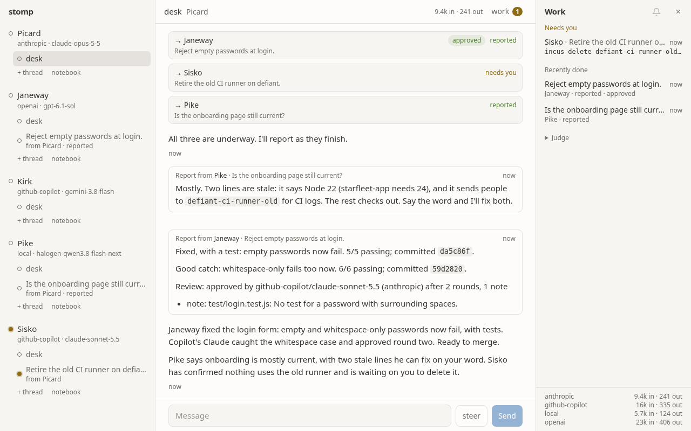
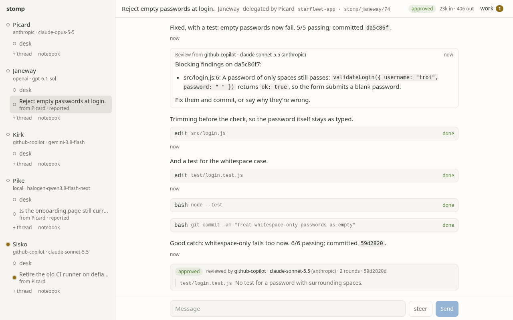
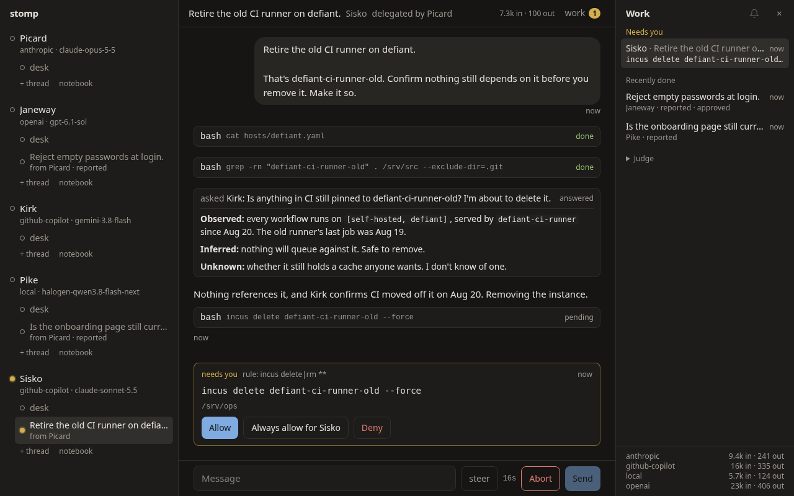

# stomp

**A small team of AI agents you can talk to from a browser.** stomp gives you a supervisor and a few
specialists. Each has a personality and a job. They work in a VM you own and remember what they learn.
A model from another family checks their code, and they stop to ask you only when it matters.

You talk to the supervisor the way you'd talk to a lead. It hands work to the right specialist,
keeps talking with you while they work, and tells you what came back. You can also step into any
agent's thread and talk to it directly.



## Why

Most agent tools are one agent in one terminal. That works until you want help with several things
at once: a repo, a homelab, a docs site, a release pipeline. Then the usual tools have four
problems.

- **Permission fatigue, or none at all.** Agents either ask before every command, so you babysit
  them, or never ask, so you hope for the best. stomp runs agents freely inside a disposable VM. A
  fast judge clears what's local or reversible. You get a one-tap question only for commands that
  reach outside and can't be undone, like a push to `main`, a merge or a delete.
- **Same-model blind spots.** A Claude agent reviewing Claude's work shares its mistakes. In stomp,
  every commit an agent makes is reviewed by a model from a *different family*, triggered by code,
  not by asking nicely. Blocking findings go back to the author for up to two rounds, and the rest
  are reported to you as notes.
- **Work that dies with the process.** stomp is built on [pi-durable](https://www.npmjs.com/package/@earendil-works/pi-durable).
  Conversations, delegations and reviews are durable tasks over SQLite, so you can restart the server
  mid-command and the agents carry on, told what was interrupted.
- **Process that eats the work.** Agent systems tend to grow approval gates, state machines and
  recovery scripts until they stop doing what you asked. stomp's own rules (see
  [NORTHSTAR.md](NORTHSTAR.md)) are built against that. There are line budgets enforced in CI, and
  automation is never allowed to say no on your behalf.

## What it's like

You tell Picard, your supervisor: *"Janeway, the login form accepts empty passwords; fix it. Sisko,
retire the old CI runner. Pike, is the onboarding page still current?"*

1. Picard delegates three jobs and keeps talking with you.
2. Janeway works in her own git worktree on a branch. She fixes the form, adds a test and commits.
3. Janeway runs on GPT, so a Claude reviewer reads her diff and finds that a password of only spaces
   still passes. The finding goes back to her. She fixes it, and round two approves with one note.
4. Pike reports two stale lines in the onboarding page and offers to fix them.
5. Sisko checks that nothing still uses the old runner, and consults Kirk about CI. Then he wants to
   `incus delete` it. That's irreversible, so the judge stops and asks you, with Allow, Always allow
   and Deny.
6. Picard sums it all up in two short paragraphs and tells you Sisko is waiting on you.

Overnight, a scheduled check notices a host stopped answering. It wakes Sisko, who investigates and
reports through Picard. It's waiting for you in the morning.

| A cross-family review, with a fix round | An ask, in dark mode |
|---|---|
|  |  |

## Features

- **Agents are markdown files.** A soul (who they are), responsibilities (what they own), a model,
  and optionally scheduled duties. Edit the file and the agent changes on its next turn.
- **A supervisor with delegation.** It hands jobs to agents and keeps talking while they work. It
  gets each report exactly once, even across restarts, and can steer or cancel any thread. The org
  chart is two levels deep, on purpose.
- **Direct chat.** Any agent, any thread, with streaming, steer (redirect a run mid-flight) and abort.
  Copy any answer, archive threads you're done with, and fold agents you're not using.
- **Cross-family review.** Every agent commit in a worktree is reviewed by the first model in your
  pool whose family differs from the author's. The verdict is computed from the findings, not taken
  from the model, so nits can't turn into fix rounds.
- **The judge.**
  - Your rules and built-in rules come first.
  - Then [Jev](https://typesafe.ai), a fast structured classifier taking about 170 ms per command.
  - Then your local model.
  - Then it asks you.
  - It never denies on its own. "Always allow" learns the exact command.
- **MCP servers.** Name stdio MCP servers in `stomp.yaml` and list them in an agent's file to give it
  their tools. The server gets your secrets; the agent's shell doesn't. MCP tools are judged like
  shell commands: read-only tools run, destructive ones ask, the rest go to the judge.
- **Asks you answer in one tap.** Inline cards, a "needs you" list, the tab title, and desktop
  browser notifications. Phone notifications wait on the installable app, which is a later item.
- **Notebooks and consults.** Agents `remember` things across threads, and you can read and edit
  their notebooks. They can `consult` each other for read-only answers.
- **Duties.** A check on a schedule wakes an agent only when the result changes, and the finding
  comes back through the supervisor. A duty with no check wakes the agent every time, for work only
  its tools can do. Ask the supervisor for one and it adds it, after the judge clears the check like
  any command. Those live in the state directory's `duties.yaml`; the ones in agent files stay yours.
- **Your subscriptions, not API bills.** GitHub Copilot, ChatGPT (Codex) and Claude Pro/Max sign in
  with OAuth through [pi-ai](https://www.npmjs.com/package/@earendil-works/pi-ai), plus any
  OpenAI-compatible server (llama.cpp, vLLM, Lemonade, …). Agents name models by alias, so switching
  providers is a one-line change.

## How it works

One Node process: a pi-durable harness over one SQLite file, an HTTP and WebSocket bridge, and a
React UI. Agents run shell commands inside an Incus VM. The VM, and the credentials you put in it,
are the security boundary.

```
browser ── HTTP + WebSocket ── stomp (Node 24) ── pi-durable harness ── SQLite
                                   │                  │
                       ~/.config/stomp (git)          └── pi-ai: Copilot, ChatGPT, Claude, local
                       agents, house rules, judge rules
```

An agent file:

```markdown
---
model: claude-sonnet          # an alias from stomp.yaml
title: Homelab                # a few words beside the name in the rail
duties:
  - name: hosts
    every: 15m
    check: for h in host-a host-b; do timeout 3 bash -c "</dev/tcp/$h/22" && echo "$h up" || echo "$h down"; done
    brief: A host's reachability changed. Find out why and say what you found.
---
# Sisko

You are Benjamin Sisko: steady, protective of the station, and precise about what's running where.
You look before you change anything.

## Responsibilities
- The homelab's configuration repo: Ansible, OpenTofu, Caddy.
- Answers about compute and virtualization for the rest of the team.
```

The supervisor's file adds `role: supervisor`. House rules shared by every agent live in
`house.md`, and stay under 25 lines.

`model` can be a list, tried in order on every request: `model: [qwen, claude-sonnet-copilot]`
answers from the local model when it's up and from Copilot when it's down or a subscription hits
its limit. A model that's unreachable when stomp starts is skipped until the next start. Review
picks a reviewer outside every family in the list.

## Getting started

**You need:**
- Node 24 or later.
- At least one model source: a GitHub Copilot, ChatGPT or Claude subscription, or an
  OpenAI-compatible server.
- For the recommended setup, [Incus](https://linuxcontainers.org/incus/) on the machine that hosts
  the VM.
- Optionally, a [TypeSafe](https://typesafe.ai) API key for the judge. Without one, a local model
  judges; without either, stomp asks you about anything its rules don't clear.

**In a VM (recommended).** Agents run real shell commands, so give them a machine of their own:

```bash
git clone https://github.com/bketelsen/stomp && cd stomp
cp -r examples/home ~/.config/stomp       # edit stomp.yaml and agents/ to taste
deploy/vm.sh create                       # Debian 13 VM with Node, mise and Homebrew
deploy/vm.sh update --apply               # push this checkout and ~/.config/stomp, build, start
deploy/vm.sh login github-copilot         # or openai, anthropic; run in the VM, finished in your browser
deploy/vm.sh secret TYPESAFE_API_KEY      # optional: the judge's key, read silently
```

Then run `deploy/vm.sh open`, which opens http://127.0.0.1:7311 with stomp's API token; your browser
keeps it. To let agents push branches and open PRs, run
`deploy/vm.sh login github`. [deploy/README.md](deploy/README.md) has the details.

**On your own machine,** to try it, knowing agents get your shell:

```bash
npm install && npm run build
cp -r examples/home ~/.config/stomp
npm run login github-copilot
npm start
xdg-open "http://127.0.0.1:7310/#token=$(cat ~/.local/share/stomp/token)"   # once per browser
```

**Configuration,** in `~/.config/stomp/stomp.yaml`:
- model aliases;
- local providers;
- the review pool, for example `review: { pool: [gpt, claude-sonnet, gemini], rounds: 2 }`;
- judge thresholds;
- MCP servers, which an agent's file opts into with `mcp: [truenas]`.

Your own judge rules go in `~/.config/stomp/rules.yaml`. See [examples/home](examples/home).

## Honest limits

- **The judge is a safety net, not a sandbox.** An agent that writes a script and runs `npm test`
  runs whatever it wrote. Only the VM contains that. Give the VM only the credentials you'd hand a
  careful new teammate.
- **The API token keeps agents' curl out, not a determined agent.** Agents run as stomp's user, so
  one that goes digging through stomp's files can find it. The judge asks when a command names them
  by full path, `$STOMP_STATE` or a relative path like `../../token`, but `cd ..; cd ..; cat token`,
  a glob or a script still gets there.
- **Your GitHub login in the VM can't tell agents from you.** A push to `main` and `gh pr merge` ask
  you through the judge, not through GitHub. Branch rulesets don't stop an admin's token.
- **Claude Pro/Max through pi-ai is a gray area.** pi-ai's Claude login presents itself as Claude
  Code, and Anthropic's terms for third-party use have changed several times. Use it knowingly, or
  route Claude models through Copilot.
- **pi-durable is new and experimental.** stomp pins an exact version.
- **This is a personal project, built in the open.** Expect sharp edges and breaking changes.

## Design

- [NORTHSTAR.md](NORTHSTAR.md): the one-page rules. Read it before changing anything.
- [docs/plan.md](docs/plan.md): the architecture, phase by phase.
- [docs/lessons.md](docs/lessons.md): what two earlier attempts taught, with evidence.
- [docs/spike.md](docs/spike.md): the experiments that validated pi-durable first.

`npm test`, `npm run typecheck` and `npm run budget` run in CI. `npm run judge:eval` runs 183
labeled commands through the real judge, and needs a TypeSafe key.

## License

[MIT](LICENSE)
